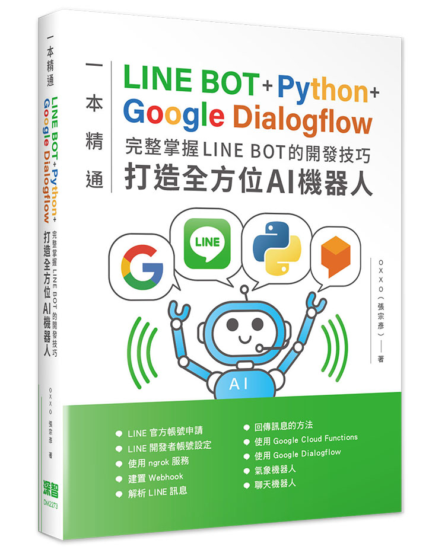

# 「LINE BOT 開發技巧」書籍範例程式碼

這是 「一本精通 - LINE BOT 開發技巧」 書籍的範例程式碼，請參考書籍內容一起練習。

> 內容更新資訊：
> - 2022/12/14：因氣象局 API 格式和網址有變，修正氣象機器人爬蟲程式。

## 章節導覽

- [Chapter 03 - 開發環境設定＆串接 LINE BOT](ch3)
- [Chapter 04 - 解析 LINE 訊息](ch4)
- [Chapter 05 - 傳送 LINE 訊息的方法](ch5)
- [Chapter 06 - 傳送不同類型的 LINE 訊息](ch6)
- [Chapter 07 - 實作 LINE 氣象機器人](ch7)
- [Chapter 08 - 串接 Dialogflow 打造聊天機器人](ch8)
- [Chapter 09 - 使用 LINE Notify 推播通知](ch9)
- [Chapter 10 - 使用 Google Clud Functions](ch10)

## 如何購買本書

- [天瓏網路書店](https://www.tenlong.com.tw/products/9786267146835?list_name=b-r7-zh_tw)。
- [博客來](https://www.books.com.tw/products/0010943754?sloc=main)。

## 更多參考

- [STEAM 教育學習網](https://steam.oxxostudio.tw)
- [STEAM 教育學習網 ( Python 教學 )](https://steam.oxxostudio.tw/category/python/info/start.html)