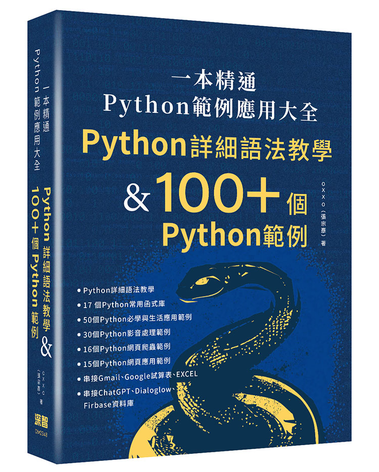

# 「Python 範例應用大全」書籍範例程式碼

這是 「一本精通 - Python 範例應用大全」 書籍的範例程式碼，請參考書籍內容一起練習。

## 章節導覽

Chapter 01 ～ Chapter 08 是 Python 基礎觀念，不檢附程式碼，希望讀者能按部就班輸入程式碼，才能真正學會 Python。

- [Chapter 09、Python 常用標準函式庫](ch09)
- [Chapter 10、Python 基礎範例](ch10)
- [Chapter 11、Python 數學範例](ch11)
- [Chapter 12、Python 實際應用](ch12)
- [Chapter 13、Python 影像處理](ch13)
- [Chapter 14、Python 聲音處理](ch14)
- [Chapter 15、Python 影片處理](ch15)
- [Chapter 16、Python 網路爬蟲](ch16)
- [Chapter 17、Python 網頁服務與應用](ch17)

## 如何購買本書

- [天瓏網路書店](https://www.tenlong.com.tw/products/9786267273678?list_name=srh)。
- [博客來](https://www.books.com.tw/products/0010964726?sloc=main)。

## 更多參考

- [STEAM 教育學習網](https://steam.oxxostudio.tw)
- [STEAM 教育學習網 ( Python 教學 )](https://steam.oxxostudio.tw/category/python/info/start.html)